<!--
  ♠ Profil : as de pique.
  Animations : SVG pur (SMIL + CSS), zéro JavaScript — GitHub sanitize le markdown,
  seul ce chemin de rendu est fiable.
  Stats : uniquement des services vérifiés comme fonctionnels sur ce profil
  (streak-stats.demolab.com, github-readme-activity-graph.vercel.app).
  github-readme-stats.vercel.app a été retiré : son instance publique est saturée
  et renvoyait des images cassées. Pour le remettre (stats + top langages),
  il faut déployer une instance perso : https://github.com/anuraghazra/github-readme-stats#deploy-on-your-own-vercel-instance
-->

  <picture>
    <source media="(prefers-color-scheme: dark)" srcset="assets/header-dark.svg">
    <source media="(prefers-color-scheme: light)" srcset="assets/header-light.svg">
    
  </picture>

> **♠ Pourquoi l’as de pique ?** Le dépassement de soi&nbsp;: ne jamais s’installer dans sa zone de confort, se perfectionner un peu plus chaque jour.

  <picture>
    <source media="(prefers-color-scheme: dark)" srcset="assets/divider-dark.svg">
    <source media="(prefers-color-scheme: light)" srcset="assets/divider-light.svg">
    
  </picture>

  <picture>
    <source media="(prefers-color-scheme: dark)" srcset="https://streak-stats.demolab.com?user=FarddownYG&locale=fr&background=0B0E13&border=2A3140&stroke=2A3140&ring=C8A96A&fire=C8A96A&currStreakNum=E8EAF0&sideNums=E8EAF0&currStreakLabel=C8A96A&sideLabels=9AA3B2&dates=6B7280&border_radius=10">
    <source media="(prefers-color-scheme: light)" srcset="https://streak-stats.demolab.com?user=FarddownYG&locale=fr&background=FBF7EE&border=D9D2C2&stroke=D9D2C2&ring=B8934A&fire=B8934A&currStreakNum=14171C&sideNums=14171C&currStreakLabel=8C6E33&sideLabels=6B7280&dates=8B857A&border_radius=10">
    
  </picture>

  <picture>
    <source media="(prefers-color-scheme: dark)" srcset="https://raw.githubusercontent.com/FarddownYG/FarddownYG/stats/records-dark.svg">
    <source media="(prefers-color-scheme: light)" srcset="https://raw.githubusercontent.com/FarddownYG/FarddownYG/stats/records-light.svg">
    
  </picture>

  <picture>
    <source media="(prefers-color-scheme: dark)" srcset="https://github-readme-activity-graph.vercel.app/graph?username=FarddownYG&custom_title=Graphique%20des%20contributions&bg_color=0B0E13&color=9AA3B2&line=C8A96A&point=E8EAF0&area=true&area_color=C8A96A&hide_border=false&radius=10">
    <source media="(prefers-color-scheme: light)" srcset="https://github-readme-activity-graph.vercel.app/graph?username=FarddownYG&custom_title=Graphique%20des%20contributions&bg_color=FBF7EE&color=5F6672&line=B8934A&point=14171C&area=true&area_color=B8934A&hide_border=false&radius=10">
    
  </picture>

  ♠ <em>une lame s’affûte tous les jours</em>

