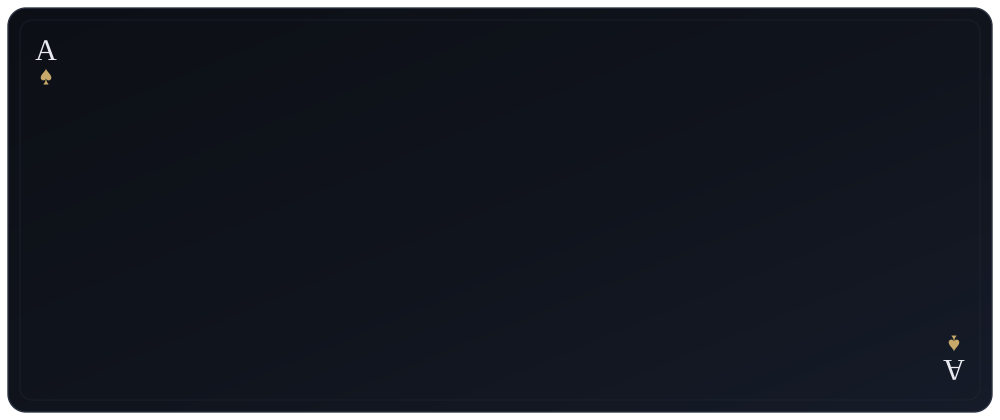

<!--
  ♠ Profil : as de pique.
  Animations : SVG pur (SMIL + CSS), zéro JavaScript — GitHub sanitize le markdown,
  seul ce chemin de rendu est fiable.
  Statistiques : toutes calculées maison par tools/build-stats.py, recalculées
  toutes les deux minutes par .github/workflows/records.yml et publiées sur la
  branche « stats » dès qu'un chiffre bouge. Le skyline est un portage SVG du
  composant React « Contribution Skyline » (21st.dev) : un README n'exécute pas
  de JavaScript, le composant lui-même ne peut pas y vivre.
  Plus aucun service tiers : les instances publiques gratuites tombent ou servent
  du cache, et on ne peut alors pas savoir si un chiffre est à jour. Chaque carte
  affiche l'heure de son calcul.
  Fraîcheur et limite structurelle : voir claude.md.
-->

  <picture>
    <source media="(prefers-color-scheme: dark)" srcset="assets/header-dark.svg">
    <source media="(prefers-color-scheme: light)" srcset="assets/header-light.svg">
    
  </picture>

> **♠ Pourquoi l’as de pique ?** Le dépassement de soi&nbsp;: ne jamais s’installer dans sa zone de confort, se perfectionner un peu plus chaque jour.
>
> Fondateur de **[Classor](https://classor.fr)**.

  <picture>
    <source media="(prefers-color-scheme: dark)" srcset="assets/divider-dark.svg">
    <source media="(prefers-color-scheme: light)" srcset="assets/divider-light.svg">
    
  </picture>

  <picture>
    <source media="(prefers-color-scheme: dark)" srcset="https://raw.githubusercontent.com/FarddownYG/FarddownYG/stats/skyline-dark.svg">
    <source media="(prefers-color-scheme: light)" srcset="https://raw.githubusercontent.com/FarddownYG/FarddownYG/stats/skyline-light.svg">
    
  </picture>

  <picture>
    <source media="(prefers-color-scheme: dark)" srcset="https://raw.githubusercontent.com/FarddownYG/FarddownYG/stats/records-dark.svg">
    <source media="(prefers-color-scheme: light)" srcset="https://raw.githubusercontent.com/FarddownYG/FarddownYG/stats/records-light.svg">
    
  </picture>

  ♠ <em>une lame s’affûte tous les jours</em>

